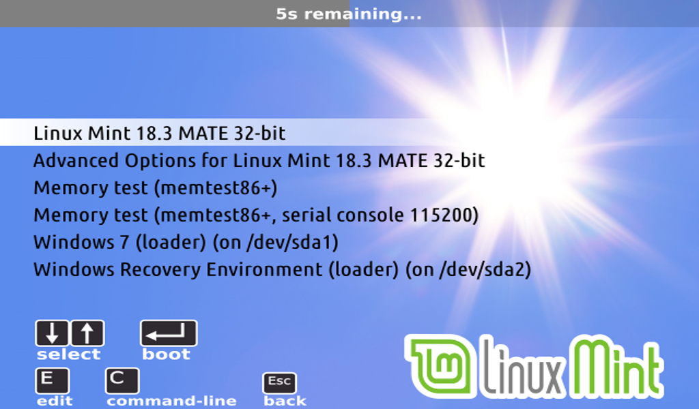

**Note:** These are just preview files. They are a close approximation of the real Grub2 screen, because we can't take screenshots in Grub2. These files were created in SVG format with Inkscape software, and they are rescaled with GIMP software.

Preview: 800x600 resolution

Preview: 800x600 resolution (Advanced Options)

Preview: 1024x768 resolution

Preview: 640x480 resolution

